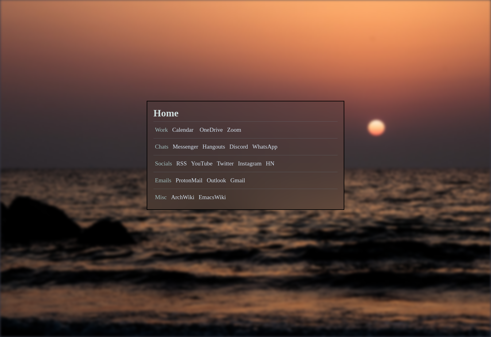

# Custom New Tab
My New Tab page. Fork of this [startpage](https://startpages.github.io/startpages/Startpage-lazyfox81/).

For chromium-based browsers (Brave, Chrome,...).

### Example:

## How to install
1. Dowmload this repo (clone with git or download the zip)
2. Go to custom-newtab and in...
  - start.html
    - change the links and categories to your liking
  - main.css
    - change the background image (you will most likely have to change the photo dimensions at least)
      - If you want to use Unsplash Source for the background images, here's a [guide](https://source.unsplash.com/)
    - Optional: Change some colors
3. In your browser, go to `chrome://extensions` and click the `Developer mode` checkbox on the top right
4. Click the `load unpacked extension...` button, navigate to the custom-newtab and select it
Enjoy.

## Caveats
- Some images may not go well with the text colors. Either change the image or the colors.
- With some setups, it can take longer to load an image from Unsplash.
